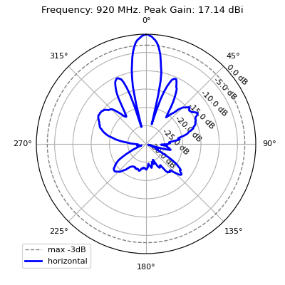
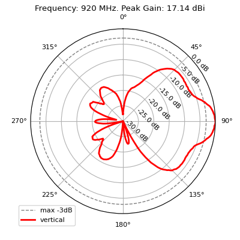

# pafx2msi

Antenna pattern convertor from PAFX to MSI format wtitten with python3.


* PAFX is ZIP archive with XML files: index `antenna.paf` and PAP-patterns `*.pap`.
* Each PAP-pattern converted to separate MSI file with frequency and tilt in suffix.


## Usage
```
Usage: python pafx2msi.py [-h|--help] [data/*.pafx]           
	   data/*.pafx  -- source files mask to convert
	
Example: 
    $ python pafx2msi.py "data/*.pafx"

	Searching data/*.pafx
	Reading PAFX data\SV460-SF2SNM.pafx
	PAF have antenna Sinclair Technologies Inc. SV460-SF2SNM
	Loaded 4 patterns for SV460-SF2SNM
	Writing MSI data/SV460-SF2SNM/SV460-SF2SNM_0890_00T.msi
	Writing MSI data/SV460-SF2SNM/SV460-SF2SNM_0920_00T.msi	
	Writing MSI data/SV460-SF2SNM/SV460-SF2SNM_0940_00T.msi
	Writing MSI data/SV460-SF2SNM/SV460-SF2SNM_0960_00T.msi
```


## See also
See also [python_antenna_pattern] which allows to plot charts for MSI patterns:






[python_antenna_pattern]: https://github.com/Strang00/python_antenna_pattern


## History
### v1.1 2024-10-18
- Dispatched NoVendor and NoVersion
- Dispatched current folder path
### v1.0 2024-06-10
- Created and tested convertor on several PAFX
- Added frequency and tilt to result files names
- Added public PAFX example from Sinclair site
